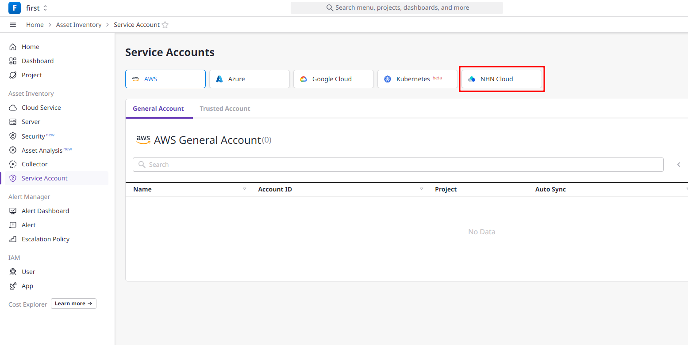
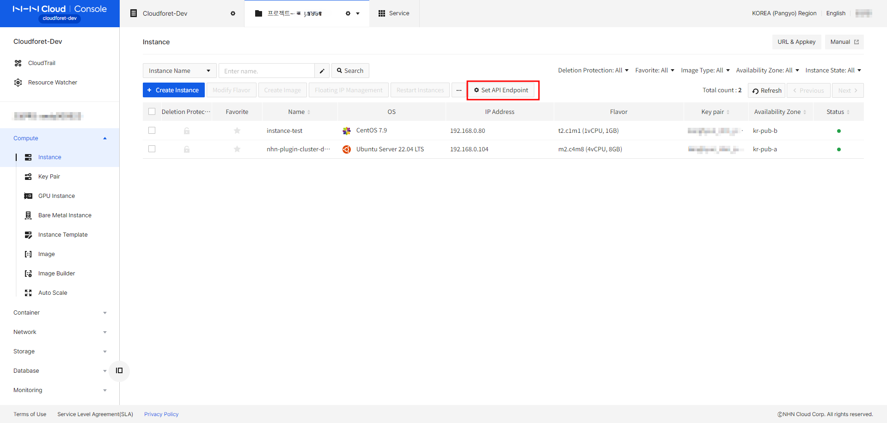
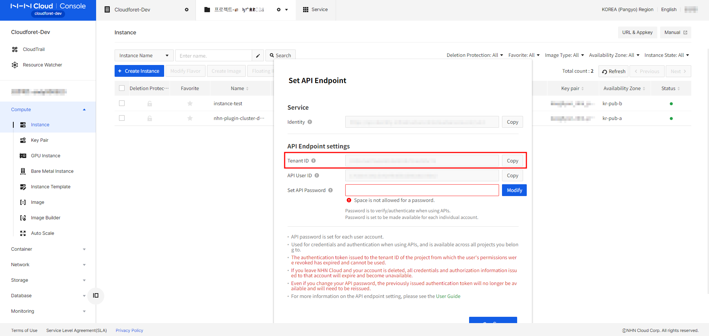
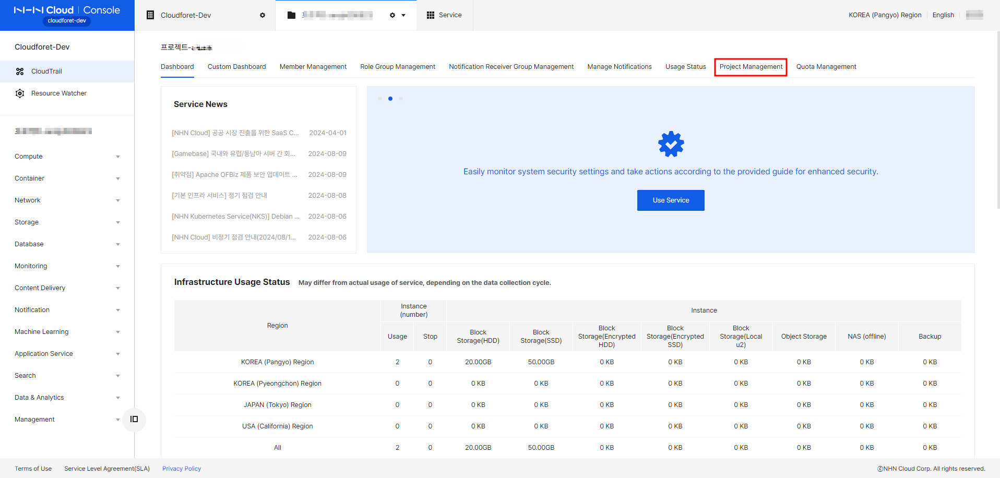
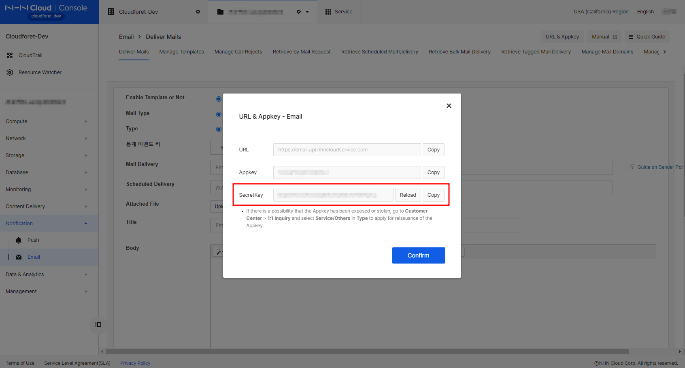
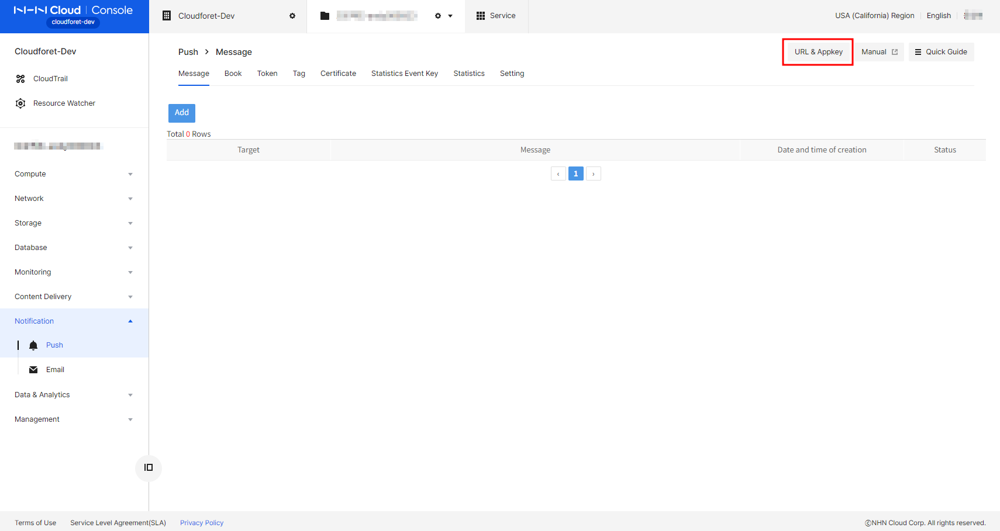
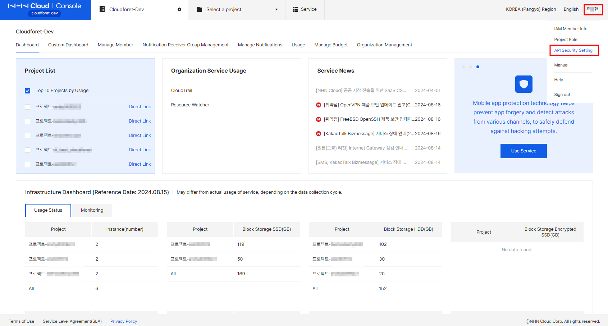
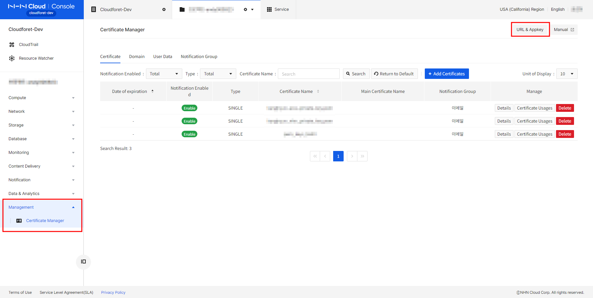
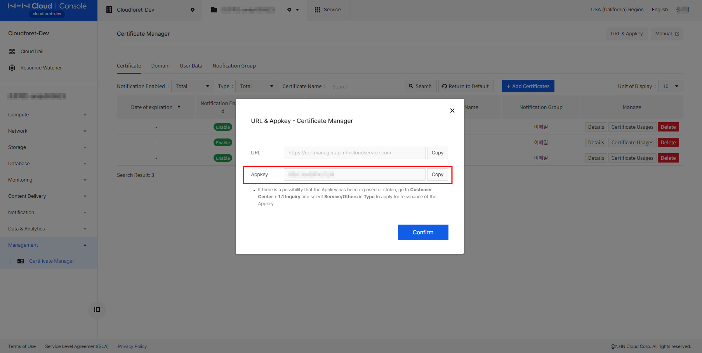
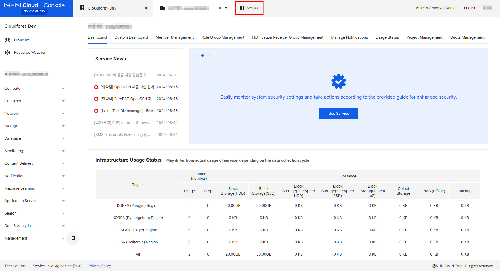

## Overview

To register an NHN Cloud service account in Cloudforet, you need the settings information below. There are four types of Schemas.

* NHN Cloud Access Key
	* `Tenant ID`
	* `Username`
	* `Password`

* NHN Cloud APP Key
	* `APP Key`
	* `Email Secret Key (optional)`
	* `Push Secret Key (optional)`
  	* `User Access Key ID (optional)`
	* `Secret Access Key (optional)`

* NHN Cloud Certificate Manager APP Key
	* `Certificate Manager APP Key`
  	* `User Access Key ID`
	* `Secret Access Key`

* NHN Cloud Object Storage Access Key
	* `Object Storage Tenant ID`
	* `Username`
	* `Object Storage Password`
    * `Storage Account`

>💡 Before starting the setup guide, please make sure **NHN Cloud User** has been created.

See the NHN Guides [NHN Documentation](https://docs.nhncloud.com/en/nhncloud/en/user-guide/)

To collect NHN Cloud resources, you have to create a NHN Cloud Service account in Cloudforet.

Go to Service Account and click [NHN Cloud] to create a NHN Cloud Service account.

Select a Project for the Service Account.

Choose Secret Type Schema and insert the Input Forms.

This setup guide will take a closer look at what the above-mentioned information means and where to obtain it.
 

### Username
**Username** is the ID you use when you login into NHN Console IAM.
 

### Tenant ID
**Tenant ID** is a **unique identifier** for your organization provided by NHN Cloud Services.
Tenant ID is a cloud-based identity and access management service that you use to manage users on an organizational basis. It is used to manage IaaS resources and issuing tokens to access resources.
 

### Password
**Password** is the password you use for login in default. But you can manage to set password for paticular services such as Compute Instance or Object Storage.
 

### APP Key
**APP Key** is the key that can be obtained through NHN Cloud project management settings. Integrated project Appkey is applied for authentication of NHN Cloud Service.
Required when using NHN Cloud's API of PaaS resources.
 

### User Access Key ID
This is the User ID that is required for user authentication to use the NHN Cloud service.
Required when using RDS and Certificate Manager resources.
 

### Secret Access Key
This is the Secret Key that is required for user authentication to use the NHN Cloud service.
Required when using RDS and Certificate Manager resources.
 

### Storage Account
This is the **Account** that can be obtained through Object Storage Service.
Required when using Object Storage resources.
 

### Email Secret Key
This is the Secret Key that is required for Email resources.
 

### Push Secret Key
This is the Secret Key that is required for Push resources.
 

We briefly discussed the concept of setup information required when registering a Cloudforet NHN Cloud service account.
Now, let's learn more about **how to actually obtain configuration information** in the next lesson.

 

## How to obtain the keys

Cloudforet supports the **[NHN_client_secret]** method through issuing authentication keys for integration with NHN Cloud.
The method using **[NHN_client_secret]** requires the following setting information.

1. NHN Cloud Access Key (for IaaS)
	* `Tenant ID`
	* `Username`
	* `Password`

2. NHN Cloud Object Storage Access Key (for Object Storage service)
	* `Object Storage Tenant ID (from Object Storage)`
	* `Username`
	* `Object Storage Password (from Object Storage)`
	* `Storage Account`

3. NHN Cloud APP Key (for PaaS)
	* `APP Key`
	* `Email Secret Key (optional key for Email service)`
	* `Push Secret Key (optional key for Push service)`
  	* `User Access Key ID (optional key for RDS service)`
	* `Secret Access Key (optional key for RDS service)`

4. NHN Cloud Certificate Manager APP Key (for Certificate Manager service)
	* `Certificate Manager APP Key (from Certificate Manager service)`
  	* `User Access Key ID`
	* `Secret Access Key`

Choose a schema or schemas you are willing to obtain, and proceed with the following order for the Schemas.

 
 

## 1. NHN Cloud Access Key

* `Tenant ID`
* `Username`
* `Password`

(1) Log in to [NHN Cloud Console](https://id.nhncloud.com/login).

(1-1) Choose the project you are using and go to [Compute - Instance].
And then click [Set API Endpoint] button.

(1-2) Then, you can find your 'Tenant ID' here. You can also click on the [Modify] button to Set API 'Password'.
'Username' is the ID you use when you login into NHN Console IAM.

 
 

## 2. NHN Cloud Object Storage Access Key

* `Object Storage Tenant ID (from Object Storage)`
* `Username`
* `Object Storage Password (from Object Storage)`
* `Storage Account`

(2) Log in to [NHN Cloud Console](https://id.nhncloud.com/login).

(2-1) Choose the project you are using and go to [Storage - Object Storage].
And then click [Set API Endpoint] button.

(2-2) Then, you can find your 'Object Storage Tenant ID' and 'Storage Account' here. You can also click on the [Modify] button to Set API 'Object Storage Password'.
'Username' is the ID you use when you login into NHN Console IAM.

 
 

## 3. NHN Cloud APP Key

* `APP Key`
* `Email Secret Key (optional key for Email service)`
* `Push Secret Key (optional key for Push service)`
* `User Access Key ID (optional key for RDS service)`
* `Secret Access Key (optional key for RDS service)`

(3) Log in to [NHN Cloud Console](https://id.nhncloud.com/login).

(3-1) Choose the project you are using and click on the [Project Management] section.

(3-2) Integrated project Appkey is applied for authentication of NHN Cloud Service. You can create your APP Key here. When your APP Key is created, you will see the APP Key below.

(3-3) Email Secret Key is an optional key for Email service. Choose the project you are using and go to [Notification - Email].
And then click [URL & Appkey] button.

(3-4) Then, you can find your 'Email Secret Key' here. Make sure to use Integrated Appkey that we created at (3-2) and not to use Appkey for specific resource.

(3-5) Push Secret Key is an optional key for Push service. Choose the project you are using and go to [Notification - Push].
And then click [URL & Appkey] button.

(3-6) Then, you can find your 'Push Secret Key' here. Make sure to use Integrated Appkey that we created at (3-2) and not to use Appkey for specific resource.

(3-7) Click your name and API Security Setting at the top right corner.

(3-8) You can create your User Access Key ID and Secret Access Key here. When your User Access Key ID and Secret Access Key is created, you will see the them below.

 
 

## 4. NHN Cloud Certificate Manager APP Key

* `Certificate Manager APP Key (from Certificate Manager service)`
* `User Access Key ID`
* `Secret Access Key`

(4) Log in to [NHN Cloud Console](https://id.nhncloud.com/login).

(4-1) Choose the project you are using and click [Management - Certificate Manager].
And then click [URL & Appkey] button.

(4-2) Then, you can find your 'Certificate Manager APP Key' here. Make sure to use Certificate Manager APP Key for this schema and not to use Integrated Appkey that we created at (3-2). This is because Certificate Manager resource can not be called with Integrated Appkey.

If you can't find the service, go to [Service] to activate the service.

