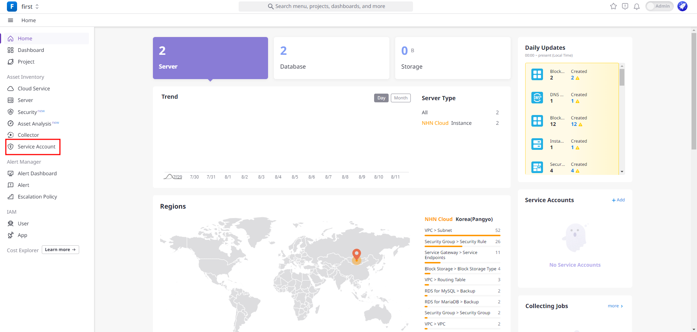
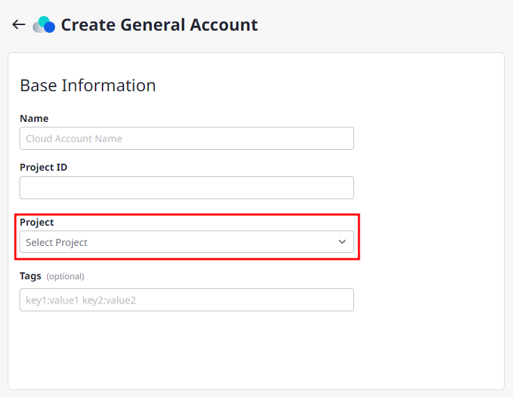
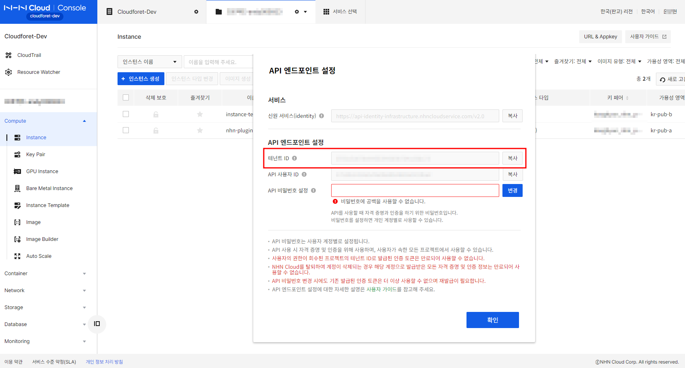
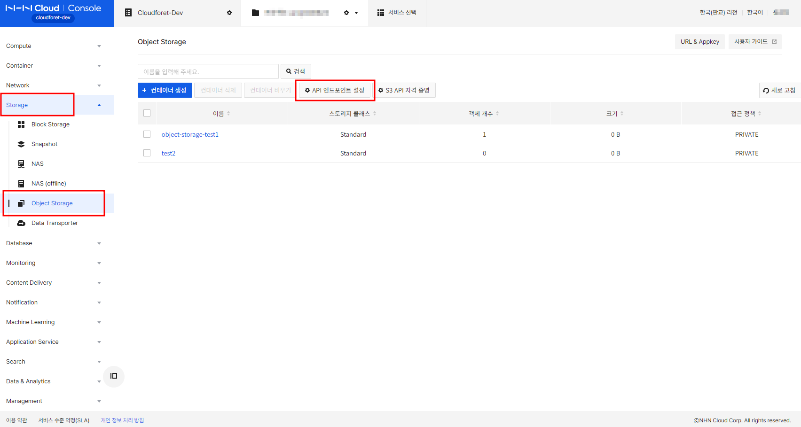
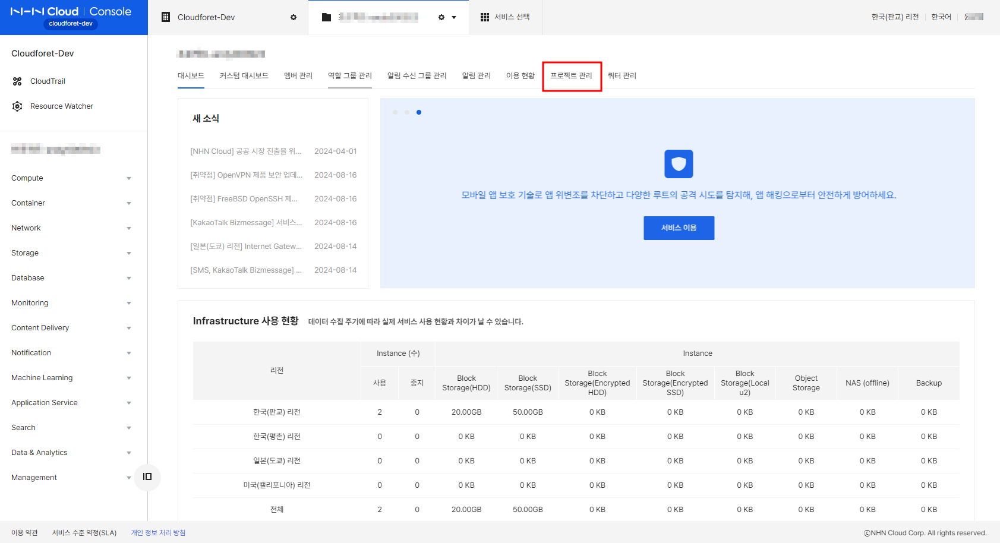
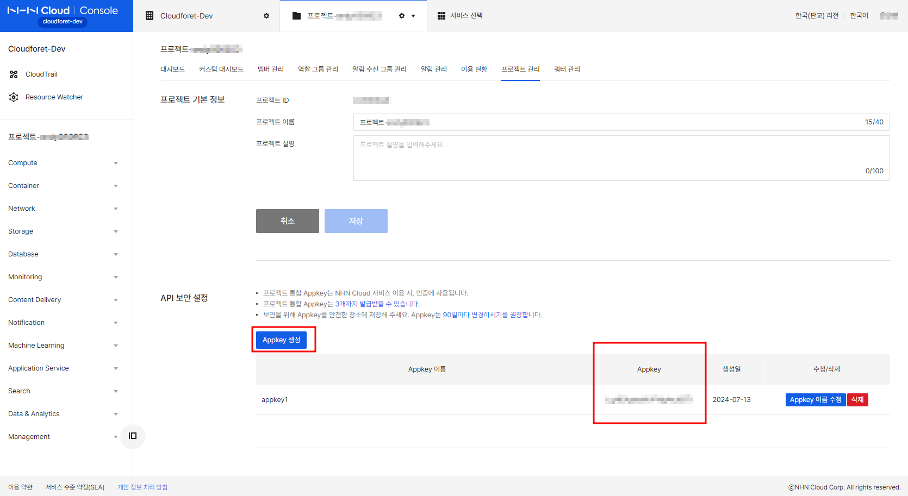
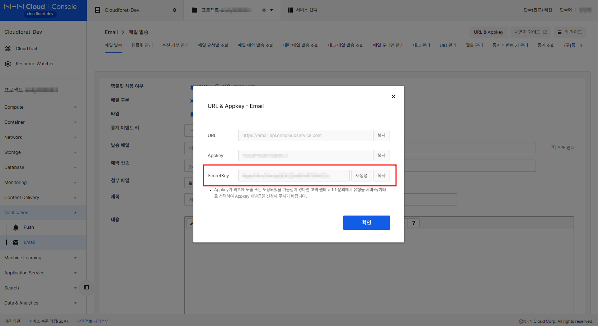
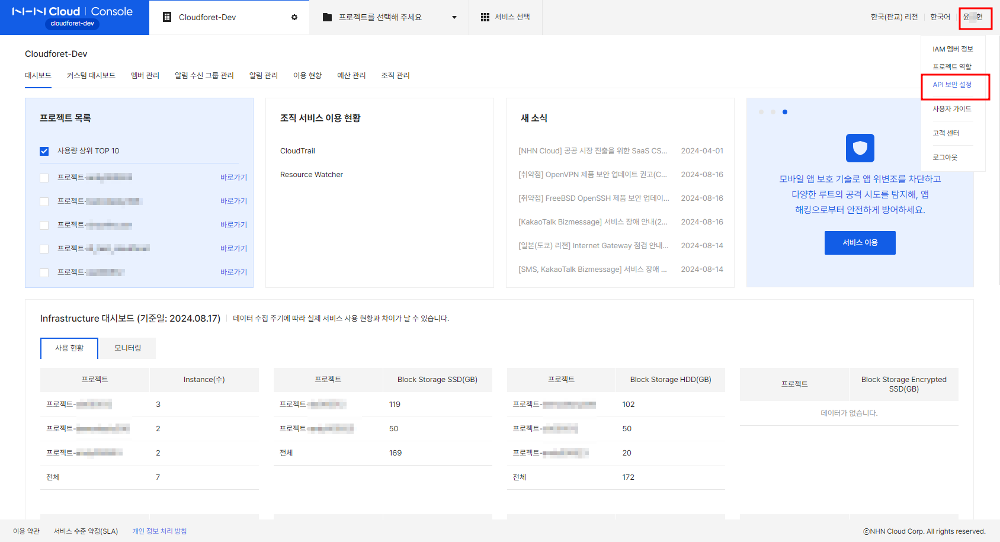

## Overview

클라우드포레에 NHN 클라우드 서비스 계정을 등록하려면 아래의 설정 정보가 필요합니다. 스키마는 네 가지 유형이 있습니다.

* NHN Cloud Access Key
    * `Tenant ID`
    * `Username`
    * `Password`

* NHN Cloud APP Key
    * `APP Key`
    * `Email Secret Key (optional)`
    * `Push Secret Key (optional)`
    * `User Access Key ID (optional)`
    * `Secret Access Key (optional)`

* NHN Cloud Certificate Manager APP Key
    * `Certificate Manager APP Key`
    * `User Access Key ID`
    * `Secret Access Key`

* NHN Cloud Object Storage Access Key
    * `Object Storage Tenant ID`
    * `Username`
    * `Object Storage Password`
    * `Storage Account`

>💡 설정 가이드를 시작하기 전에 **NHN Cloud User** 가 생성 되었는지 확인하세요.

NHN 가이드 보기 [NHN Documentation](https://docs.nhncloud.com/en/nhncloud/en/user-guide/)

NHN 클라우드 리소스를 수집하려면 클라우드포레에서 NHN 클라우드 서비스 계정을 만들어야 합니다.

서비스 계정으로 이동하여 [NHN Cloud]를 클릭하여 NHN 클라우드 서비스 계정을 생성합니다.

서비스 계정에 대한 프로젝트를 선택합니다.

스키마를 선택하고 입력란을 채워 넣습니다.

아래 설정 가이드에서는 위에서 언급한 정보의 의미와 해당 정보를 어디서 가져오는 것인지 살펴보겠습니다.
 

### Username
**Username** 은 NHN 콘솔 IAM에 로그인할 때 사용하는 아이디입니다.
 

### Tenant ID
**Tenant ID** 는 NHN 클라우드 서비스에서 제공하는 조직을 위한 **고유 식별자**입니다.
테넌트 ID는 조직 단위로 사용자를 관리하기 위해 사용하는 클라우드 기반 ID 및 접근 관리 서비스입니다. IaaS 리소스를 관리하고 리소스에 접근하기 위한 토큰을 발급하는 데 사용됩니다.
 

### Password
**Password** 는 기본적으로 로그인에 사용하는 비밀번호입니다. 그러나 Compute Instance 또는 Object Storage 와 같은 특정 서비스에 대한 비밀번호를 따로 설정할 수도 있습니다.
 

### APP Key
**APP Key** 는 NHN 클라우드 프로젝트 관리 설정을 통해 획득할 수 있는 키입니다. 통합 프로젝트 앱키는 NHN 클라우드 서비스 인증을 위해 적용됩니다.
NHN 클라우드의 PaaS 리소스 API 이용 시 필요합니다.
 

### User Access Key ID
NHN 클라우드 서비스를 이용하기 위해 사용자 인증에 필요한 사용자 ID입니다.
RDS 및 Certificate Manager 리소스를 사용할 때 필요합니다.
 

### Secret Access Key
NHN 클라우드 서비스를 이용하기 위한 사용자 인증에 필요한 비밀키입니다.
RDS 및 Certificate Manager 리소스를 사용할 때 필요합니다.
 

### Storage Account
오브젝트 스토리지 서비스를 통해 얻을 수 있는 **계정**입니다.
오브젝트 스토리지 리소스를 사용할 때 필요합니다.
 

### Email Secret Key
이메일 리소스에 필요한 비밀 키입니다.
 

### Push Secret Key
푸시 리소스에 필요한 비밀 키입니다.
 

클라우드포레 NHN 클라우드 서비스 계정을 등록할 때 필요한 설정 정보의 개념에 대해 간략하게 알아보았습니다.
그럼 다음으로 실제로 설정 정보를 얻는 방법에 대해 자세히 알아보겠습니다.

 

## 키값 확인하는 방법

클라우드포레는 NHN 클라우드와의 연동을 위해 인증키 발급을 통한 **[NHN_client_secret]** 방식을 지원합니다.
**[NHN_client_secret]** 를 사용하는 방식은 다음과 같은 설정 정보가 필요합니다.

1. NHN Cloud Access Key (for IaaS)
    * `Tenant ID`
    * `Username`
    * `Password`

2. NHN Cloud Object Storage Access Key (for Object Storage service)
    * `Object Storage Tenant ID (from Object Storage)`
    * `Username`
    * `Object Storage Password (from Object Storage)`
    * `Storage Account`

3. NHN Cloud APP Key (for PaaS)
    * `APP Key`
    * `Email Secret Key (optional key for Email service)`
    * `Push Secret Key (optional key for Push service)`
    * `User Access Key ID (optional key for RDS service)`
    * `Secret Access Key (optional key for RDS service)`

4. NHN Cloud Certificate Manager APP Key (for Certificate Manager service)
    * `Certificate Manager APP Key (from Certificate Manager service)`
    * `User Access Key ID`
    * `Secret Access Key`

본인이 사용하는 리소스에 대한 스키마를 모두 고르고 스키마에 대한 작업을 진행합니다.

 
 

## 1. NHN Cloud Access Key

* `Tenant ID`
* `Username`
* `Password`

(1) [NHN Cloud Console](https://id.nhncloud.com/login)에 로그인합니다.

(1-1) 사용 중인 프로젝트를 선택하고 [Compute - Instance]로 이동합니다.
그리고 [API 엔드포인트 설정] 버튼을 클릭합니다.

(1-2) 여기에서 '테넌트 ID'를 찾을 수 있습니다. [변경] 버튼을 통해 API '비밀번호'를 설정할 수도 있습니다.
'username'은 NHN 콘솔 IAM에 로그인할 때 사용하는 아이디입니다.

 
 

## 2. NHN Cloud Object Storage Access Key

* `Object Storage Tenant ID (from Object Storage)`
* `Username`
* `Object Storage Password (from Object Storage)`
* `Storage Account`

(2) [NHN Cloud Console](https://id.nhncloud.com/login)에 로그인합니다.

(2-1) 사용 중인 프로젝트를 선택하고 [Storage - Object Storage]로 이동합니다.
그리고 [API 엔드포인트 설정] 버튼을 클릭합니다.

(2-2) 여기에서 '오브젝트 스토리지 테넌트 ID'와 '스토리지 계정'을 확인할 수 있습니다. [변경] 버튼을 통해 API '오브젝트 스토리지 비밀번호'를 설정할 수도 있습니다.

 
 

## 3. NHN Cloud APP Key

* `APP Key`
* `Email Secret Key (optional key for Email service)`
* `Push Secret Key (optional key for Push service)`
* `User Access Key ID (optional key for RDS service)`
* `Secret Access Key (optional key for RDS service)`

(3) [NHN Cloud Console](https://id.nhncloud.com/login)에 로그인합니다.

(3-1) 사용 중인 프로젝트를 선택하고 [프로젝트 관리] 섹션을 클릭합니다.

(3-2) NHN 클라우드 서비스의 인증을 위해 통합 프로젝트 앱키가 적용됩니다. 여기에서 앱키를 생성할 수 있습니다. 앱키가 생성되면 아래와 같이 앱키가 표시됩니다.

(3-3) 이메일 Secret 키는 이메일 서비스를 위한 옵션 키입니다. 사용 중인 프로젝트를 선택하고 [Notification - Email]로 이동합니다.
그 다음 [URL & Appkey] 버튼을 클릭합니다.

(3-4) 여기에서 'Email Secret Key'를 확인할 수 있습니다. 앱키는 (3-2)에서 생성한 통합 앱키를 사용해야 하며 해당 리소스에 대한 앱키를 사용하지 않도록 주의하세요.

(3-5) 푸시 Secret 키는 푸시 서비스를 위한 옵션 키입니다. 사용 중인 프로젝트를 선택하고 [Notification - Push]로 이동합니다.
그 다음 [URL & Appkey] 버튼을 클릭합니다.

(3-6) 여기에서 'Push Secret Key'를 확인할 수 있습니다. 앱키는 (3-2)에서 생성한 통합 앱키를 사용해야 하며 해당 리소스에 대한 앱키를 사용하지 않도록 주의하세요.

(3-7) 오른쪽 상단 모서리에 있는 이름, API 보안 설정을 클릭합니다.

(3-8) 여기에서 사용자 액세스 키 ID와 비밀 액세스 키를 생성할 수 있습니다. 사용자 액세스 키 ID와 비밀 액세스 키가 생성되면 아래와 같이 표시됩니다.

 
 

## 4. NHN Cloud Certificate Manager APP Key

* `Certificate Manager APP Key (from Certificate Manager service)`
* `User Access Key ID`
* `Secret Access Key`

(4) [NHN Cloud Console](https://id.nhncloud.com/login)에 로그인합니다.

(4-1) 사용 중인 프로젝트를 선택하고 [Management - Certificate Manager]로 이동합니다.
그 다음 [URL & Appkey] 버튼을 클릭합니다.

(4-2) 그 다음 여기에서 'Certificate Manager APP Key'를 확인할 수 있습니다. 이 스키마에는 (3-2)에서 생성한 통합 앱키를 사용하지 않고 Certificate Manager APP Key를 사용해야 합니다. 통합 앱키로는 Certificate Manager 리소스를 호출할 수 없기 때문입니다.

만약 특정 서비스를 찾을 수 없는 경우 [서비스 선택]으로 이동하여 서비스를 활성화하세요.

